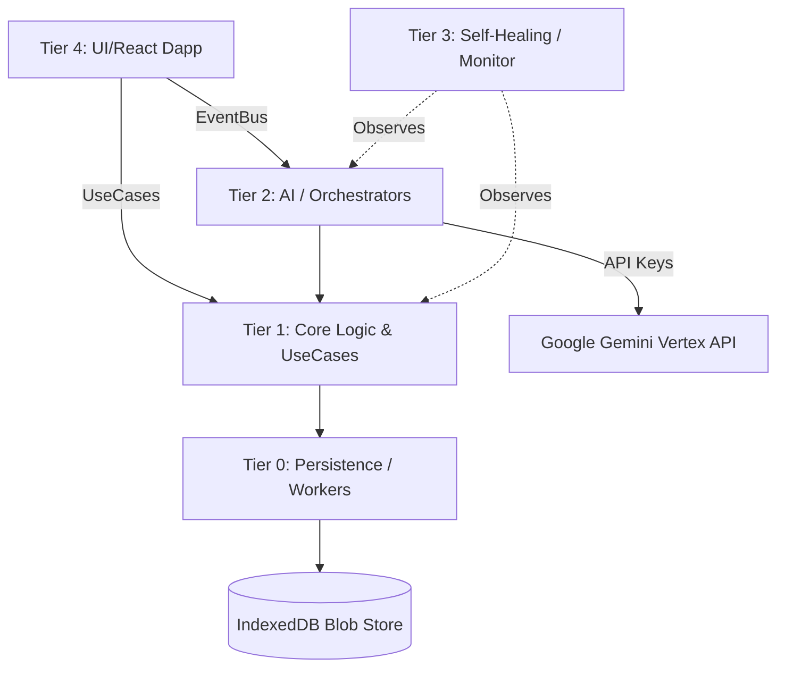

# RETROFORGE AI: The Supreme Binary Engineering Ecosystem

<div align="center">
  <h3><strong>AI-Powered Reverse Engineering & Binary Modding at Industrial Scale</strong></h3>
  <br>
</div>

**RetroForge AI** redefines the paradigm of binary manipulation. It fuses classic reverse engineering capabilities with next-generation Artificial Intelligence, forming an unyielding, memory-safe, and self-healing engine capable of parsing, decompiling, and modifying legacy architectures (MIPS, ARM, x86, M68K). 

Designed under the **Omni-Engineer v2.0-ULTIMATE Protocol**, this platform implements high-performance multi-threading, self-healing circuits, telemetry, and zero-trust data safety.

---

## 🌌 Infinite Evolution Architecture (The Creator)

RetroForge uses a rigorous **Clean Architecture** to separate domains, ensuring absolute decoupling between logic and UI.

### Architectural Diagram (Conceptual)


### 🏢 System Tiers
- **Tier 0 (Foundation)**: Persistent Blob Storage (up to 1GB binaries), WebWorker Thread Pools, LRU Caching mechanisms.
- **Tier 1 (Core Logic)**: Functional manipulation of binary streams. `ApplyPatchUseCase`, `ScannerUseCase`, `BinaryIntegrityUseCase`.
- **Tier 2 (Intelligence)**: Stateful orchestrators. The `aiDecompilerService` acts as a multi-model proxy with circuit-breakers and exponential backoff.
- **Tier 3 (Guardian)**: `MonitorService` and `SelfHealingService`. Calculates EMA (Exponential Moving Average) error rates, actively resetting sub-systems during critical failures without human intervention.
- **Tier 4 (Presentation)**: Real-time telemetry dashboards and Modding Hubs, built dynamically with Tailwind, Lucide, and Recharts.

---

## ⚡ Extreme Optimization (The Optimizer)

- **Portable SDK Engine**: The core logic (`src/core/`) and infrastructure (`src/services/`) compile directly into raw ESM via `build:sdk` for cross-platform integration (Electron, Rust, CLI).
- **Asynchronous WebWorkers**: Intensive pattern scanning is pushed to background threads, guaranteeing 60FPS UI rendering even during 50MB binary iterations.
- **Heuristic Symbol Detection**: The `ScannerUseCase` integrates logic to rapidly isolate strings, byte signatures, and function boundaries.

---

## 🛡️ Industrial Security & Resilience (The Guardian)

- **Circuit Breakers**: External API integrations are shielded by a robust `CircuitBreaker`. It detects rate limits (429) & timeouts, opening the circuit to prevent cascading system failures.
- **Automated Snapshots**: Zero-data-loss guarantee. Any destructive write operation creates an automatic history snapshot.
- **CRC32 Integrity**: Memory is continually validated against CRC32 checksums, terminating operations if corruption is detected.
- **Graceful Degradation**: Application components gracefully fall back to alternative AI models or manual hex-editing when external streams fail.

---

## 🏭 Production Ecosystem (The CTO)

We deliver absolute CI/CD readiness.
- **Docker Ready**: A minimal, multi-stage, non-root Alpine Dockerfile ensures the deployment size is microscopic and highly secure.
- **Docker Swarm / K8s**: `docker-compose.yml` provides a production-ready network configuration with Healthchecks and limits.
- **CI/CD Action**: `.github/workflows/ci.yml` validates code quality (linters), dependencies, builds the runtime and portable SDK, and mocks Snyk/Trivy pipelines.
- **Telemetry**: `loggerService.ts` mimics Winston/Log4j formats for easy parsing by ELK/Datadog stacks.

---

## 🚀 Quickstart & Pipeline

### Developer Setup
```bash
# 1. Install dependencies
npm ci

# 2. Start Full-Stack Engine (Vite + Express in one command)
npm run dev

# 3. Build the Portable SDK for remote integrations
npm run build:sdk

# 4. Standard App Build
npm run build
```

### Docker Deployment
```bash
# Build & Spin up RetroForge App on port 3000
docker-compose up -d --build
```

---
*Built autonomously by Supreme Omni-Engineer v2.0.*
